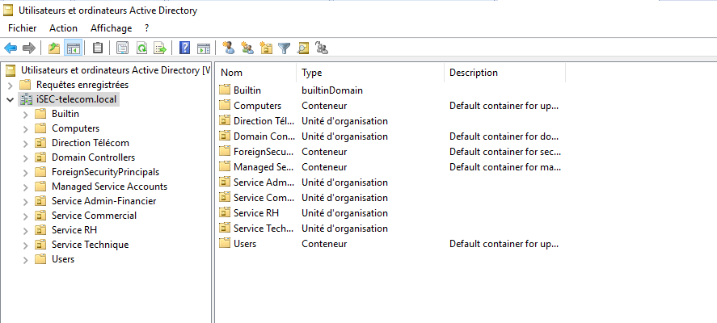
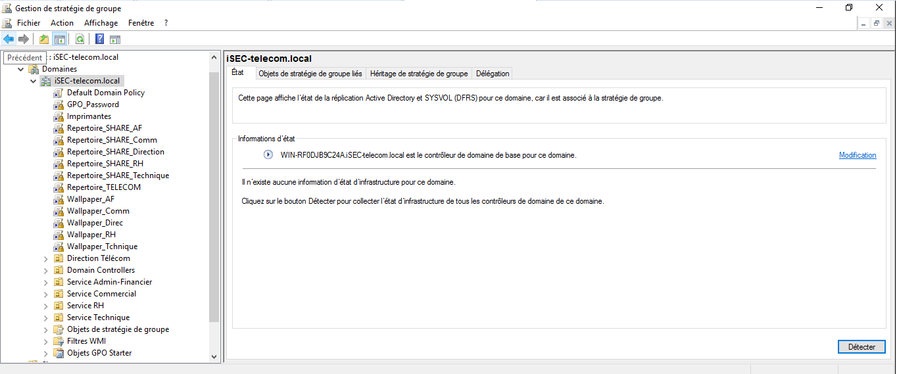
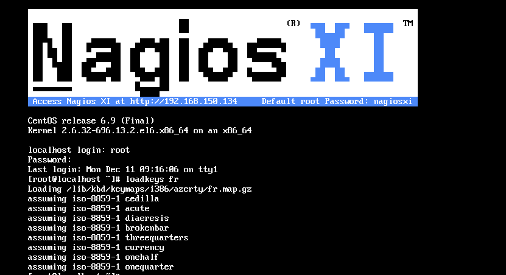
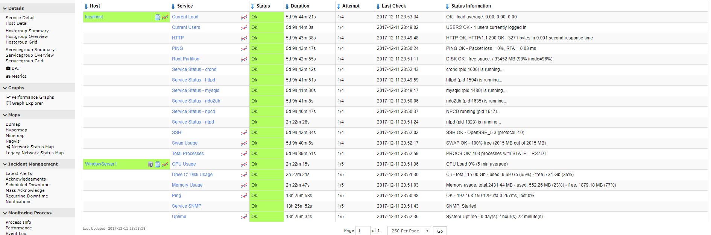

# Projet ISEC
## *A3 Exia 2017*
## Introduction :mag_right:

Dans le cadre du projet **Server Architecture et Administration** il nous été demandé de mettre en œuvre l’architecture Active Directory de la maison mère et celle de la filiale télécom d'une entreprise nommée ISEC.
Nous avons donc à installer le contrôleur de domaine principal et réplica pour le groupe et le contrôleur de domaine télécom. 
En fonction des organigrammes, nous aurons aussi à créer et organiser les utilisateurs et groupes dans l’arborescence Active Directory et justifier l’organisation choisie. 
En outre, un systeme de supervision sera à mettre en place sur les serveurs précédemment installés.

## Besoins techniques :page_facing_up:
### Cahier des charges

Installation du contrôleur de domaine Windows Server iSEC Groupe
  - Serveur en IP fixe
  - DNS fonctionnel en recherche directe
  - DNS fonctionnel en recherche inverse
  - Promotion du serveur comme DC dans une nouvelle forêt
  - DHCP fonctionnel

Installation du contrôleur de domaine Windows Server iSEC Télécom
  - Serveur en IP fixe
  - Installation fonctionnelle (DNS, promotion…)
  - Réplication fonctionnelle avec le serveur principal

Configuration des droits de partages et d'accès aux ressources, GPO, déploiement d'application sur les postes clients
  - Répartition des utilisateurs en OU cohérentes
  - Démonstration des partages avec les bons droits en fonction des utilisateurs
  - Démonstration des GPO du CDC
  - Déploiement d'applications fonctionnel
  - Approbation entre forêts fonctionnelle et correctement paramétrée (unidirectionnelle groupe->télécom)

Supervision
  - Supervision processeur/mémoire/disque d'un poste Windows
  - Justification du choix de la solution
  - Surveillance de l'état des services des services DNS et DHCP

### Planification :bar_chart:

#### Demande

Ci-contre le lien vers le Trello du projet :arrow_forward:
[Trello](https://trello.com/b/T8vvbAFE/isecproject)

#### OBS

#### PBS

#### WBS

#### PERT

#### GANTT

## Réalisation :pencil2:

### Paramétrage des différents services

### Pool d'adresses

### IP du routeur et du service DNS

### Paramétrage des unités d'organisation

### Paramétrage des GPO

### Serveur Nagios

### Interface graphique de nagios avec supervision des services

## Bilan :heavy_check_mark:

Le projet ISEC s'est déroulé dans sa globalité en accord avec les diagrammes prévisionnels et sans grande difficulté en particulier. Il est cependant à noter le dépassement dans le temps de certaines tâches, ce dernier justifié par quelques problèmes mineurs mais bien présents de compatibilité machine ou de mauvais paramétrage.
Pour ce qui est du groupe en général, bonne symbiose et écoute globale sont à noter. 

